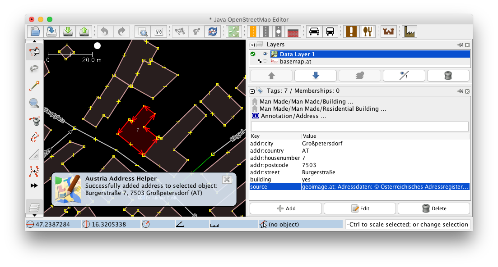

JOSM Plugin: Austria Address Helper
===================================

This [Java OpenStreetMap Editor (JOSM)](https://josm.openstreetmap.de/) plugin automatically assigns addresses to an
object. It uses the [BEV Address Data Reverse Geocoder](https://bev-reverse-geocoder.thomaskonrad.at/) for this. That
web service uses the address data sets released by the Bundesamt für Eich- und Vermessungswesen (BEV) in Austria.

To use it, simply activate the ``austriaaddresshelper`` plugin in the JOSM preferences dialog. In order to assign an
address to an object in Austria, press **Strg + Alt + B** (Linux, Windows) / **⌥ ⌘ + B** (macOS) or simply use the
"Fetch Address" menu item from the "Tools" menu.

Data Source And Permission
--------------------------

The data source is the [address data set of the Austrian Federal Office for Calibration and Measurement (Bundesamt für
Eich- und Vermessungswesen)](http://www.bev.gv.at/portal/page?_pageid=713,2168079&_dad=portal&_schema=PORTAL) (see
section "Unentgeltliche Produkte").

    Data: © Österreichisches Adressregister, Stichtagsdaten vom 02.10.2016
    
There is also a [written permission for the OpenStreetMap project](https://lists.openstreetmap.org/pipermail/talk-at/2016-November/008596.html)
to use the data with this plugin.
